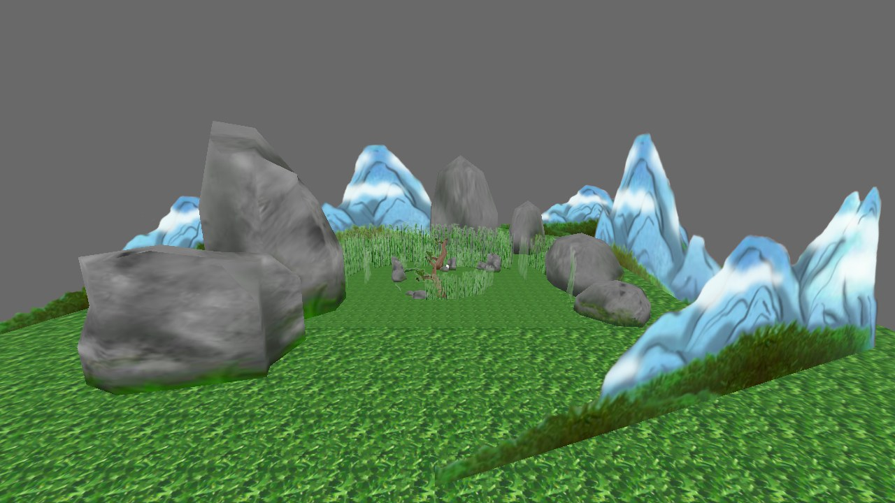
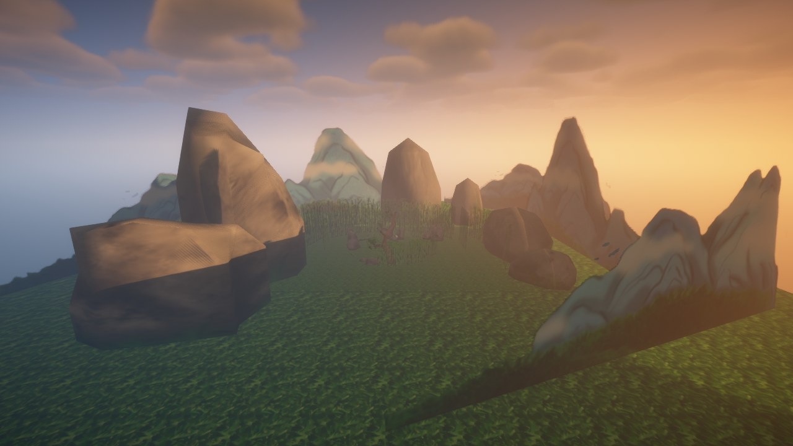

# Minecraft Shader Decompiler

Run a **Minecraft shaderpack's entire deferred pipeline** (shadows, gbuffers,
deferred lighting, composite chain, final) inside an OpenGL game engine, and
re-shade your whole game by swapping the pack.

You tag your objects with Minecraft *render types* (`terrain`, `entity`, …) and
the pack does the rest. Quality profiles and every option the pack exposes are
driven through an Iris-style options system, live.

Primary engine is **Panda3D**; the pack parsing, options, render-graph and GLSL
translation layers are engine-independent.

## What it looks like

Panda3D's bundled "environment" scene, same camera, same geometry, rendered by
Panda3D alone, then by BSL v10 through this pipeline at the `MEDIUM` profile:

| Without | With |
|---|---|
|  |  |

## Install

```bash
pip install ".[panda3d]"
```
OR run the build.py program with the --install flag

## Demo

```bash
python -m mcshader demo
```

That opens the scene above. `WASD`/`QE` to fly, `[1]`-`[5]` to switch quality
profile, `[o]` for the pack's live settings panel, `[y]` to toggle the pack off
and back on.

## Use it

```python
import mcshader

app = mcshader.init()                        # window + pack + sky + fly camera
app.load("models/environment", type="terrain", scale=0.25)
app.load_actor("models/panda-model", {"walk": "models/panda-walk4"},
               type="entity", loop="walk")

app.profile = "MEDIUM"
app.run()
```

To shade a game you already have, hand `init()` your own `ShowBase` and tag the
nodes you already made:

```python
app = mcshader.init(base)
app.attach(ground, type="terrain")
app.attach(crystal, type="glowing", block="minecraft:sea_lantern")
```

`app.pipe` is the full pipeline renderer and `app.base` your `ShowBase`, so
nothing is a dead end.

## Notes

Validated against BSL v10 on Apple M1 / Mesa, OpenGL 4.6 core. BSL is the only shaderpack confirmed to work, more will be fixed and implemented later

Python 3.10+. MIT licensed.
